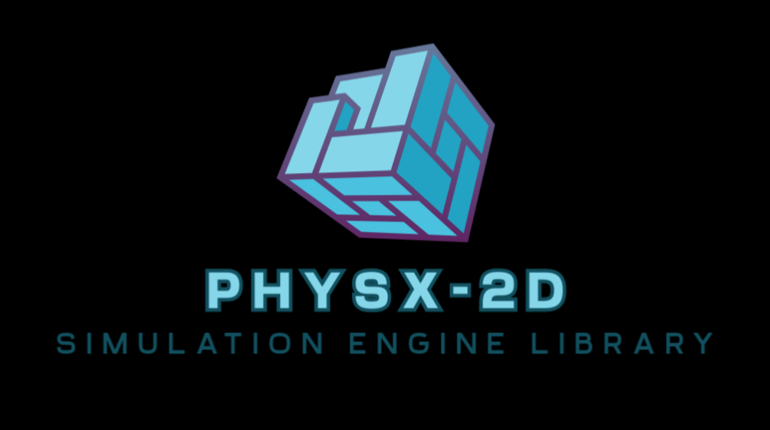

# Physx-2D


Physx-2D is a in-development early stage physics and rendering engine for mainly 2D graphics. It is programmed for supporting multiple platform.

It has many features that should be in a effective game engine/library. As of now, Physx-2D is only available as library with many tools optimized for general and specific purpose.

## Getting Started
Scripts for immediately getting started for using this library are given with code. **setup.sh** sets the project up for development and **make_install.sh** makes an install of the project in build/physx2d directory, which you can move to your own project and configure the include/ and lib/ directories accordingly to use in the project. Here's the [***project***](https://github.com/therealsunx/Physx2D-SandBox) that uses this library.

Here's how you can use it.
```
git clone https://github.com/therealsunx/Physx-2D
cd Physx-2D

./setup.sh
./make_install.sh
mv build/physx2D /path/to/your/project/
```
now set include/ directory inside physx2d/ as your projects include lookup directory and lib/ as link/library lookup directory.

# Features
## Rendering 
Rendering feature as a whole is most important part and is build in a way that with almost no changes at all, it can be used for 3D rendering too. But, for now it is forced to be 2D. After all it comes down to number of floats per vertex.

* Normal Renderer
     > For rendering a single 2D-model/objects
* Instanced Renderer
     > For faster rendering of multiple similiar models/objects
* Framebuffer
     > For post-processing of the render
* Textures
     > For adding textures to objects
* Shaders
     > For shading the model/objects

A lot of optimization have been done in the rendering aspect of the engine to finally reduce the rendering time of thousands of objects to less than 0.1ms in release mode. Another plus side is that there are few default renderers implemented inside the engine for more reliability. Also default shader is also embedded directly inside the renderer. Some special shaders are also pre-written for better experience. 

## Utilities

Besides, there are some utility objects that can be used for multiple purposes.
* General Buffers
     > Buffers for storing data for being processed by GPU
* Compute Shaders
     > Perform any processing/calculation on GPU in parallel
* QuadTree
     > QuadTree can be used for space partitioning in 2D-Space. It is also used by this engine for collision detection optimization.

## 2D Physics

Physics system is a very deep and nice thing about the engine to talk about. Entities (game objects) can have a rigidbody component which handles all the kinetics and kinematics. Along with this Colliders are there to make things for physics better. 

QuadTree is used for handling on-screen collisions of object, when no clustering of thousands of objects is present, this can handle many colliding objects over tens of  thousands in number. Framerate will drop if thousands of objects are clustered in one place. No substeps for collision optimization is implemented and no separate thread for handling physics is implemented till now. A generalized collision detection and resolution method used is now in 'average' state. Type of collision detection used now is discrete. This part of engine works well for over few thousands collider components with the numbers being dependent on component type.

There are 4 types of colliders that can be used now,
* CircleColliders
* BoxCollider2D
* AABB (Axis Aligned Bounding Box)
* Bounding Circle

Among them, last 2 colliders are static (and implemented only to make it easy to setup a physics simulation where objects won't fly off screen. On a single screen, AABB and BoundingCircles should not overlap with any of each other due to what they are made for.

## Math

Mathematical part of the engine includes some features like : 
* 2-Component vector
* 3-Component vector
* 4-Component vector
* 3x3 matrix
* Pseudo Random Number generator
     > As a function for short term random numbers and as an object for auto-seed update which is proved to best for procedural generations.
* Projection matrices and view matrices
* Center-rect (which is same as rect but instead of topleft and width-height as data, it uses center and width-height as data.

## Entity Component System

A Physx-2D world handles objects according to their components (data oriented design) rather than inherited properties (object oriented design). This enables an object to have any combination of properties. Components currently available are :
* Transform
* Tag
* RendererComponent
* Collider : 
    * BoxCollider2D
    * CircleCollider
    * AABB
    * Bounding Circle
     {An object can have only one type of collider at a time}
* RigidBody2D
* ScriptComponent

This game engine as of now does not have an integrated UI as aneditor. So, development is fully code based.

## Logging system

A simple yet effective logging system is implemented which is made to display the logged data in the debug mode. This will strip off the logging code in any other mode which makes the engine event faster in other mode and useful is debug mode.

* LOG_INFO logs the informations in green color
* LOG_WARN logs the informations in yellow color
* LOG_ERROR logs the informations in red color

**Other Highly Performance oriented Features**
> Also, ASSERTIONS are available in any mode as long as enabled.

> Also DEBUG_ONLY_EXPRESSIONS are also implemented which allows for debug mode to be effective in doing many things (e.g. performance evaluation and comparision).

> All these features are automatically enabled in respective build mode. These features can be enabled manually by defining some constants in any mode.

## SandBox
Time to time, some interesting simulations are added here. This is a general playground for anyone using it. With compute shaders added now, multiple processings for simulations can be now performed in parallel in GPU. Some simulations added till now are : 

* Autonomous agents :
   * Boids

* Ray tracing : *Under-work*

* Cellular Automata :
   * Conway's game of life
   * Evan's larger than life
   * Wolfram cellular automata rules simulations
   * Belousov-Zhabotinsky reaction
   * Another Reaction-Diffusion simulation that does something weird and spectacular

* Multi-Neighbour Cellular Automata:
   * Mitosis
   * Bacteria
   * Worms
   * Circles (But actually resembles a forest fire somehow.... kept the bug because it looks cool)

* Wave Function Collapse :
  * Some idea of quantum mechanics implemented in this engine to do some procedural generation of complex things from simple things
  * *Incomplete* (Backtracking not implemented but still works fine)

## Others
There are many things I did not explained about the engine here. Take a look at code or contact me if you want to understand it.

Anyone is free to contribute to some bug-fixing, feature-adding, suggestions, etc. Enjoy !!!!!!!!!!
